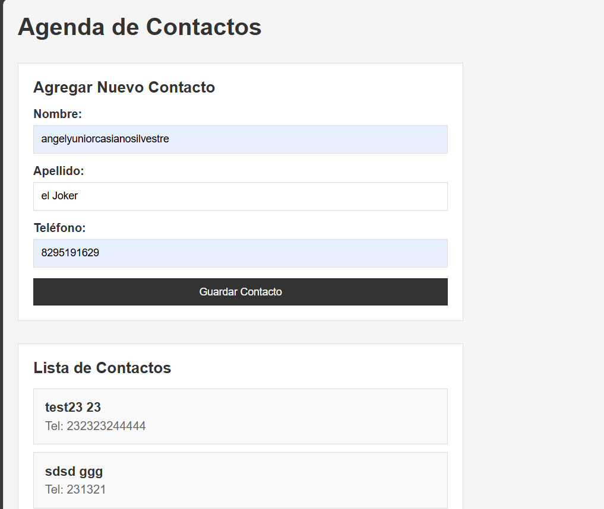

# Agenda Web - Tarea 3: Agenda Multicapas

## Descripción
Agenda de contactos web que permite visualizar y agregar contactos usando Fetch API con métodos GET y POST.

## Características
- Visualización de contactos almacenados
- Formulario para agregar nuevos contactos
- Comunicación con API mediante Fetch
- Uso de formato JSON para envío y recepción de datos
- Diseño responsive

## Capturas de Pantalla

### Captura 1


### Captura 2


## Tecnologías Utilizadas
- HTML5
- CSS3
- JavaScript (ES6+)
- Fetch API
- JSON

## Estructura del Proyecto
```
Agenda-Multicapas/
├── index.html
├── index.js
└── imagenes/
    ├── Screenshot_120.png
    └── Screenshot_121.png
```

## Autor
Yunior Casiano
